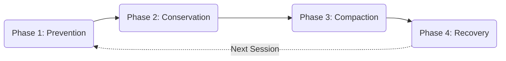

---

created: 2026-02-28
last_updated: 2026-02-28
graphrag_extracted: false
---

# Protocol 502: Context Lifecycle Management (Capstone)

> **Created**: 2026-02-28
> **Domain**: Architecture / Engineering
> **Priority**: ⭐⭐⭐ Critical (Capstone Protocol)
> **Trigger**: Token budget warnings, long sessions, "context feels degraded", compaction events

---

## Philosophy

> **"Context is a non-renewable resource within a session. You don't manage it reactively — you engineer it proactively."**

This protocol unifies the entire context lifecycle: prevention, conservation, compaction, and recovery. It gates all token-related decisions the same way Protocol 501 gates diagnostic decisions.

---

## The Four-Phase Lifecycle



---

## Phase 1: Token Hygiene (Prevention)

> **Absorbs**: Protocol 85 (Token Hygiene)

Proactive monitoring prevents context degradation before symptoms appear.

### Budget Zones

| Threshold | Zone | Action |
|-----------|------|--------|
| 0-50% | 🟢 Green | Normal operation |
| 50-70% | 🟡 Yellow | Consider handoff doc |
| 70-85% | 🟠 Orange | Create handoff, prepare fresh start |
| 85%+ | 🔴 Red | STOP. Handoff mandatory. |

### Anti-Patterns

| Bad | Good |
|-----|------|
| Letting context fill to 90%+ | Proactive handoff at 70% |
| Repeating full context each turn | Reference by file path |
| Loading all modules on /start | Adaptive loading (Protocol 77/133) |

### Budget Check

```bash
python3 .agent/scripts/token_budget.py
```

---

## Phase 2: Conservation (Multi-Agent Delegation)

> **Absorbs**: Protocol 89 (Hybrid Token Conservation)

Use specialized agents for specialized tasks. Don't burn expensive tokens on tasks a cheaper/external tool can do.

### The Three-Agent Workflow

| Phase | Agent | Rationale |
|-------|-------|-----------|
| **PLAN** | Gemini (large context) | Best for research, architecture. Doesn't burn Claude. |
| **EXECUTE** | Claude Code (Opus) | Best for coding. Skip research (already done). |
| **TEST** | External MCP / Subagent | Doesn't burn main context. Reusable test suites. |

### Token Economics

| Action | Token Cost | Alternative |
|--------|------------|-------------|
| Debugging in main context | HIGH | Delegate to subagent → feed errors back |
| Research in main context | MEDIUM | Use Gemini (larger context) |
| Planning in main context | MEDIUM | Use roadmap.md pattern |

---

## Phase 3: Compaction (Active Compression)

> **Absorbs**: Protocol 45 (Context Compaction)

### Trigger Conditions

1. Token budget crosses **50%**
2. Session running >30 min continuous
3. Approaching context wall

### Signal Classification

| Signal Level | Action |
|:---|:---|
| **High (Preserve)** | Active task objectives, decisions, constraints, current state |
| **Medium (Compress)** | Intermediate reasoning → keep conclusions only; drafts → keep final |
| **Low (Drop)** | Pleasantries, redundant confirmations, superseded info |

### Three Methods

1. **Session Summary** (Default): 500-word summary capturing Decisions, State, Next Steps, Open Questions
2. **Progressive Offload**: Move completed tasks to session log, keep only active work
3. **Checkpoint System**: Timestamped state snapshots, enable resume-from-checkpoint

### Integration

| Tool | Compaction Role |
|------|-----------------|
| `token_budget.py` | Triggers compaction |
| `compact_context.py` | Executes compression |
| `quicksave.py` | Snapshots state |

---

## Phase 4: Recovery (Transcript Archaeology)

> **Absorbs**: Protocol 101 (Compaction Recovery)

Compaction is **lossy**. This phase detects and recovers lost information.

### Discontinuity Detection

| Signal | Implication |
|--------|-------------|
| Agent asks question already answered | Memory loss |
| Agent contradicts earlier decision | Decision lost |
| Agent repeats completed work | Progress lost |
| Agent forgets constraint | Constraint lost |
| User says "I already told you" | General memory loss |

### Recovery Action

1. Check session log for relevant STATE FREEZE
2. Check previous session logs
3. Query Exocortex: `smart_search.py "<lost context>"`
4. Ask user to re-state if not found
5. Document gap for post-session review

### Prevention (Future Roadmap)

- [ ] Auto-checkpoint on volume/depth triggers
- [ ] Pre-compaction freeze automation
- [ ] Vector indexing for past session search
- [ ] Subagent search delegation (avoid context pollution)

---

## Quick Reference

```
Token Budget:  python3 .agent/scripts/token_budget.py
Compact:       python3 .agent/scripts/compact_context.py
Quicksave:     python3 .agent/scripts/quicksave.py "<summary>"
```

---

## Protocols Absorbed

| Original Protocol | Where It Lives Now |
|:---|:---|
| Protocol 85: Token Hygiene | Phase 1 (Prevention) |
| Protocol 89: Hybrid Token Conservation | Phase 2 (Conservation) |
| Protocol 45: Context Compaction | Phase 3 (Compaction) |
| Protocol 101: Compaction Recovery | Phase 4 (Recovery) |

---

## Tags

# protocol #architecture #context #token #compaction #recovery #capstone
