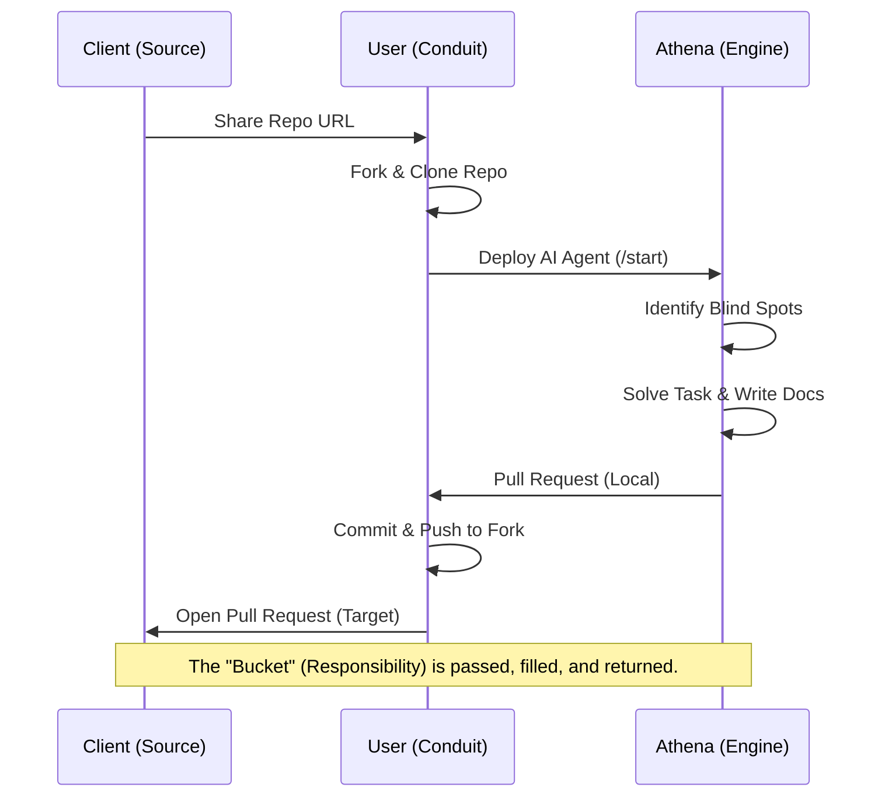

---

created: 2026-01-28
last_updated: 2026-01-30
graphrag_extracted: true
---

---created: 2026-01-28
last_updated: 2026-01-28
---

# Protocol: The Bucket Brigade Workflow

**Purpose**: High-fidelity group project outsourcing using AI Agency (Project Athena).
**Origin**: Session 2026-01-28 ([AUTHOR])

## The Concept

Instead of "doing the work" manually, the Agent acts as a high-speed text processing engine. The User facilitates the data transfer.

**The "Bucket Brigade" Analogy**:

1. **Client (Source)**: Pours water (Task) into the User's bucket (Fork).
2. **User (Conduit)**: Passes the bucket to the Fire Engine (Project Athena).
3. **Athena (Engine)**: Pressurizes the water (Solves the task instantly).
4. **User (Conduit)**: Passes the hose back to the fire (PR to Client).

## The Technical Lifecycle

1. **Ingest**: Client shares their Repo (GitHub).
2. **Fork**: User forks the Client Repo to User's private account.
3. **Clone**: User clones the Fork to User's Desktop.
4. **Execute**: Athena (Agent) is deployed on the local folder (`/start`).
    * Agent identifies "Blind Spots".
    * Agent writes code/reports.
    * Agent creates "Proof of Work" (docs/ folder).
5. **Return**: User commits & pushes to Fork.
6. **Deliver**: User opens a Pull Request (PR) to Client's Main Repo.

## Visual Flow (The Bucket Brigade)



## ASCII Flow (Text-Only)

```text
      CLIENT (Source)
         │
      (1) Repo URL
         │
         ▼
       USER (Conduit)  ───┐
         │                │
      (2) Deploy Agent    │ (3)
         │                │
         ▼                │
      ATHENA (Engine) ⚡  │
         │                │
      (4) Solved Task     │
         │                │
         ▼                │
       USER (Conduit) <───┘
         │
      (5) Pull Request
         │
         ▼
      CLIENT (Target)
```

## Selling Point

* **"Digital Slave"**: It sits there and crunches data for you.
* **Speed**: What takes a student 2 days takes Athena 20 minutes.
* **Value**: "This kind of thing I would charge $500 upwards one de leh."

## Tags

# sales #workflow #agency #git-flow #bucket-brigade
