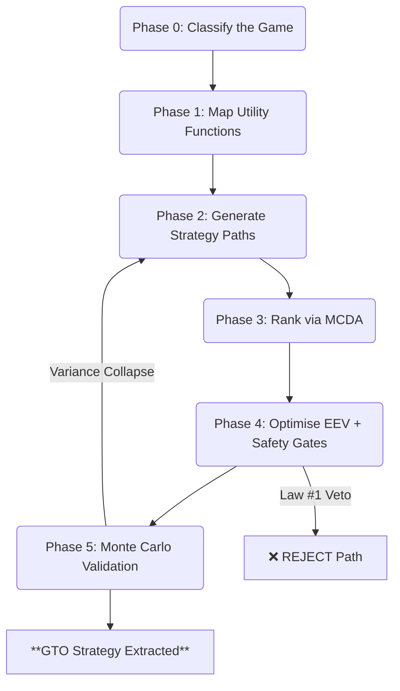

# Protocol 500: GTO Problem Solver (The Unified Solver)

> **Created**: 2026-02-28
> **Domain**: Decision / Strategy / Risk / Multi-Agent
> **Priority**: ⭐⭐⭐ Critical (Capstone Protocol)
> **Trigger**: Complex problem with multi-agent, multi-variable, mixed-environment dynamics; "What is the optimal move?"; "Solve this"

---

## Philosophy

> **"You cannot solve a problem until you know what game you are playing, who is playing it, and what each player is *actually* optimising for."**

Traditional problem-solving fails in real-world environments because it assumes:

1. A single decision-maker (reality: **multi-agent**)
2. Perfect information (reality: **asymmetric information**)
3. Pure determinism or pure randomness (reality: **mixed**)
4. A single objective function (reality: **multi-variate weighted**)
5. Ergodic dynamics (reality: **absorbing barriers exist**)

This protocol is the **Unified Solver**. It chains six phases to extract the Game Theory Optimal (GTO) strategy — the strategy that **maximises EEV** while being **unexploitable** regardless of opponent action.

---

## The Six-Phase Pipeline



---

## Phase 0: Game Classification

> **Invoke**: [Protocol 422: Game Taxonomy](<!-- Private: .agent/skills/protocols/ --> decision/422-game-taxonomy.md)

Before solving, classify the environment along **three axes**:

### Axis 1: Determinism Spectrum

| Classification | Signal-to-Noise | Solver Mode |
|:---|:---|:---|
| **Pure Deterministic** | 100% signal | Backwards Induction (full tree) |
| **Semi-Deterministic** | High signal, human variance | Heuristic tree + Agent Modelling |
| **Semi-Stochastic** | Mixed signal + structural noise | Probability-weighted EV trees |
| **Pure Stochastic** | 100% noise | **Don't play.** (Exit) |

### Axis 2: Ergodicity

| Classification | Test | Implication |
|:---|:---|:---|
| **Ergodic** | No absorbing barriers; losses are recoverable | MEV analysis is valid; optimise for expected value |
| **Non-Ergodic** | Absorbing barriers exist (bankruptcy, death, ruin) | MEV analysis is **invalid**; optimise for survival first, then EEV |

> **Diagnostic**: `P(Survive N trials) = (1-r)^N`. If survival < 80% over realistic N → **Non-ergodic veto**.

### Axis 3: Information Completeness

| Classification | Example | Strategic Implication |
|:---|:---|:---|
| **Perfect Information** | Chess, Go | Pure calculation dominates |
| **Imperfect Information** | Poker, Negotiations | Bayesian updating + range-based thinking |
| **Asymmetric Information** | Job interviews, M&A | Information edge = dominant advantage; **Protocol 135** applies |

### Phase 0 Output

```
GAME CLASSIFICATION:
  Determinism:  [Pure Det / Semi-Det / Semi-Stoch / Pure Stoch]
  Ergodicity:   [Ergodic / Non-Ergodic / Mixed (specify dims)]
  Information:  [Perfect / Imperfect / Asymmetric]
  Agent Count:  [N agents]
  Time Horizon: [One-shot / Repeated / Infinite]
  
  ⚠️ VETO CHECK: Pure Stochastic → EXIT. Non-Ergodic + High P(ruin) → RESTRICT.
```

---

## Phase 1: Stakeholder Utility Mapping

> **Invoke**: [Protocol 180: Utility Function Analysis](<!-- Private: .agent/skills/protocols/ --> decision/180-utility-function-analysis.md)

For **each agent/stakeholder**, extract their utility function:

```
U(Agent_i) = W₁×Factor₁ + W₂×Factor₂ + W₃×Factor₃ + ... + Wₙ×Factorₙ

Where:
  Σ Wᵢ = 1.0
  Factors = What they are ACTUALLY optimising for (revealed preference, NOT stated preference)
```

### 1A: The De Facto Matrix

| Agent | Stated Goal (De Jure) | Actual Goal (De Facto) | GTO Counter |
|:---|:---|:---|:---|
| You | [What you say you want] | [What you actually optimise for] | [Align actions to De Facto] |
| Agent B | [What they claim] | [What their behaviour reveals] | [Predict and counter] |
| Agent C | ... | ... | ... |

### 1B: Interaction Mapping

| Relationship | Type | Implication |
|:---|:---|:---|
| You ↔ Agent B | **Cooperative** | Seek Nash Bargaining Solution (maximise joint surplus) |
| You ↔ Agent C | **Competitive** | Seek Minimax / Unexploitable Strategy |
| Agent B ↔ Agent C | **Mixed** | Model their coalition dynamics |

### 1C: Asymmetric Utility Check

> **Question**: "Does any agent's utility function contain a term with $U = -\infty$ (ruin-class outcome)?"
>
> - If **YES** for you → That dimension is **non-ergodic**. Apply Law #1 constraint.
> - If **YES** for opponent → That is their **pressure point**. Potential leverage (ethical only).

### Phase 1 Output

```
UTILITY MAP:
  U(Self)    = 0.40×[Factor A] + 0.30×[Factor B] + 0.20×[Factor C] + 0.10×[Factor D]
  U(Agent B) = 0.50×[Factor X] + 0.30×[Factor Y] + 0.20×[Factor Z]
  
  Interaction Type: [Cooperative / Competitive / Mixed]
  Ruin Dimensions:  [List any non-ergodic factors]
```

---

## Phase 2: Strategy Generation (Divergence)

> **Invoke**: [Protocol 137: Graph of Thoughts](<!-- Private: .agent/skills/protocols/ --> decision/137-graph-of-thoughts.md) + [Protocol 75: Synthetic Parallel Reasoning](decision/75-synthetic-parallel-reasoning.md)

Generate **minimum 3 distinct strategic paths**. Do NOT evaluate yet. Just diverge.

### The Three Mandatory Lenses

| Path | Lens | Generated By |
|:---|:---|:---|
| **Path A** | **Aggressive / Exploit** | "What if I maximise MEV regardless of risk?" |
| **Path B** | **Defensive / Survive** | "What if I minimise downside regardless of upside?" |
| **Path C** | **Lateral / Asymmetric** | "What if I change the game entirely?" |

### For Semi-Stochastic Games: Branch on States of the World

Each path must be evaluated across **states of nature** (the stochastic component):

```
Path A:
  ├── State S₁ (P = 0.40): Outcome = [X]  → U = [N]
  ├── State S₂ (P = 0.35): Outcome = [Y]  → U = [M]
  └── State S₃ (P = 0.25): Outcome = [Z]  → U = [K]
```

### For Multi-Agent Games: Model Counter-Moves

Each path must account for each agent's **best response**:

```
Path A:
  Your Move: [Action]
  Agent B's Best Response: [Counter] (based on U(Agent B))
  Agent C's Best Response: [Counter] (based on U(Agent C))
  Resultant Payoff: [Your payoff after all responses]
```

### Phase 2 Output

A **GoT Graph** (minimum 3 paths, with state probabilities and agent counter-moves modelled).

---

## Phase 3: Multi-Criteria Ranking

> **Invoke**: [Protocol 121: MCDA / EEV / Pairwise](<!-- Private: .agent/skills/protocols/ --> decision/121-mcda-eev-framework.md)

### 3A: Define Criteria and Weights

Criteria must be drawn from YOUR utility function (Phase 1):

| Criterion | Weight | Rationale |
|:---|:---|:---|
| Survival (Law #1) | [W₁] | Non-negotiable floor |
| Expected Payoff (MEV) | [W₂] | Mathematical return |
| Utility Payoff (E(U)) | [W₃] | Non-monetary value (dignity, optionality, time) |
| Robustness to Error | [W₄] | "How badly does this fail if I'm wrong?" |
| Reversibility | [W₅] | "Can I undo this if it goes badly?" |

### 3B: Score Each Path

| Path | Survival | MEV | E(U) | Robustness | Reversibility | **Weighted Score** |
|:---|:---|:---|:---|:---|:---|:---|
| Path A (Aggressive) | N/10 | N/10 | N/10 | N/10 | N/10 | **X.XX** |
| Path B (Defensive) | N/10 | N/10 | N/10 | N/10 | N/10 | **X.XX** |
| Path C (Lateral) | N/10 | N/10 | N/10 | N/10 | N/10 | **X.XX** |

### 3C: Pairwise Gut-Check

```
Path A vs Path B → Winner: [?]
Path B vs Path C → Winner: [?]
Path A vs Path C → Winner: [?]

Pairwise Leader: [Path with most wins]
```

> **Inconsistency Check**: If MCDA Leader ≠ Pairwise Leader → Your criteria weights are wrong. Re-examine.

### Phase 3 Output

```
MCDA RANKING:
  #1: Path [X] (Score: X.XX)
  #2: Path [Y] (Score: Y.YY)
  #3: Path [Z] (Score: Z.ZZ)
  
  Pairwise Alignment: [Consistent / Inconsistent — re-examine if inconsistent]
```

---

## Phase 4: EEV Optimisation & Safety Gates

> **Invoke**: [Protocol 330: EEV](<!-- Private: .agent/skills/protocols/ --> decision/330-expected-aggregate-value.md) + [Protocol 193: Ergodicity Check](<!-- Private: .agent/skills/protocols/ --> decision/193-ergodicity-check.md)

For the **top-ranked path** from Phase 3:

### 4A: EEV Calculation

```
MEV  = Σ [ P(state_i) × V(outcome_i) ]                    (Mathematical Expected Value)
E(U) = Subjective Utility × Skeptic's Discount (0.8)       (Constrained Utility)
E(O) = Opportunity Cost × Energy Modifier (0 if low energy) (Real Opportunity Cost)

EEV  = MEV + E(U) - E(O)
```

### 4B: Safety Gate Cascade

| Gate | Check | Verdict |
|:---|:---|:---|
| **Gate 1: Law #1 (Ruin)** | Does any state contain P(ruin) > 5%? | ❌ **HARD REJECT** — No exceptions |
| **Gate 2: Ergodicity** | Is P(survive N iterations) > 80%? | ❌ **HARD REJECT** if below threshold |
| **Gate 3: Variance Tax** | Is this a high-variance path? | ⚠️ Add 10% stress tax to MEV |
| **Gate 4: Reversibility** | Can this decision be undone? | ⚠️ If irreversible, require EEV > 2× threshold |
| **Gate 5: EEV Sign** | Is EEV > 0? | ❌ **REJECT** if EEV ≤ 0 |

### 4C: Non-Ergodic Dimension Handling

> **Critical**: Real-world problems are often **ergodic on some dimensions** and **non-ergodic on others**.

| Dimension | Ergodic? | Handling |
|:---|:---|:---|
| Financial | [Yes/No] | If non-ergodic: Kelly sizing, max drawdown limits |
| Reputational | [Usually No] | If non-ergodic: Zero tolerance for public-facing risk |
| Relational | [Usually No] | If non-ergodic: One-strike boundary enforcement |
| Health | [Usually No] | If non-ergodic: Absolute veto on physical risk |
| Legal | [Usually No] | If non-ergodic: Absolute veto on legal exposure |

> **Rule**: The overall strategy is constrained to the **strictest non-ergodic dimension**. A strategy that is brilliant financially but carries a 5% reputational ruin risk is **rejected**.

### Phase 4 Output

```
EEV ANALYSIS:
  MEV:  $[X] / [unit]
  E(U): $[Y] / [unit] (after Skeptic's Discount)
  E(O): $[Z] / [unit] (after Energy Modifier)
  EEV:  $[Result] / [unit]
  
SAFETY GATES:
  Law #1:        [PASS / FAIL]
  Ergodicity:    [PASS / FAIL] (Survival: [X]% over [N] iterations)
  Variance Tax:  [Applied / N/A]
  Reversibility: [Reversible / Irreversible]
  EEV Sign:      [POSITIVE / NEGATIVE / NEUTRAL]
  
  VERDICT: [✅ PROCEED / ❌ REJECT / ⚠️ PROCEED WITH CONSTRAINTS]
```

---

## Phase 5: Sensitivity Validation (Monte Carlo)

> **Invoke**: Monte Carlo Simulation Skill

### 5A: Identify Fragile Assumptions

List every assumption made in Phases 1–4 and stress-test:

| Assumption | Sensitivity | "What if this is wrong by 2×?" |
|:---|:---|:---|
| Agent B's utility weights | [High/Med/Low] | [Impact on GTO] |
| P(State S₁) = 40% | [High/Med/Low] | [Impact on EEV] |
| E(U) = $X/hr | [High/Med/Low] | [Impact on EEV sign] |

### 5B: Monte Carlo Simulation

Run N = 1,000+ iterations with:

- Randomised state probabilities (±20% from base estimates)
- Randomised agent responses (range of plausible counter-moves)
- Randomised utility weights (±15% from self-reported weights)

### 5C: Robustness Criteria

| Metric | Threshold | Verdict |
|:---|:---|:---|
| **% of simulations where EEV > 0** | Must be > 70% | [PASS/FAIL] |
| **% of simulations where Ruin occurs** | Must be < 5% | [PASS/FAIL] |
| **Median EEV** | Must be positive | [PASS/FAIL] |
| **Variance Drag** | Must not exceed 50% of Mean EEV | [PASS/FAIL] |

> **If Monte Carlo FAILS**: Return to **Phase 2** and generate additional paths or modify the leading strategy to reduce the fragile assumption's influence.

### Phase 5 Output

```
MONTE CARLO RESULTS (N = [X] iterations):
  % Positive EEV: [X]%
  % Ruin:         [X]%
  Median EEV:     $[X]
  Variance Drag:  [X]% of Mean
  
  VERDICT: [✅ ROBUST / ⚠️ FRAGILE — return to Phase 2 / ❌ UNRELIABLE]
```

---

## Final Output: The GTO Strategy

```
══════════════════════════════════════════════════
  PROTOCOL 500: GTO SOLUTION
══════════════════════════════════════════════════

  GAME TYPE:     [Classification from Phase 0]
  AGENTS:        [N players mapped]
  
  GTO STRATEGY:  [Clear, actionable recommendation]
  
  WHY THIS DOMINATES:
    1. [Reason — linked to MCDA ranking]
    2. [Reason — linked to EEV calculation]
    3. [Reason — linked to Monte Carlo robustness]
  
  CONSTRAINTS:
    - [Non-ergodic dimension restrictions]
    - [Position sizing / Kelly limits if applicable]
  
  IMPLEMENTATION:
    - Today:      [Immediate action]
    - This week:  [Short-term action]
    - This month: [Medium-term action]
  
  FRAGILE ASSUMPTIONS TO MONITOR:
    - [Assumption 1 — re-evaluate if [trigger]]
    - [Assumption 2 — re-evaluate if [trigger]]
  
══════════════════════════════════════════════════
```

---

## When NOT to Use This Protocol

| Situation | Do Instead |
|:---|:---|
| Simple binary choice | Use Protocol 121 (MCDA) directly |
| Pure calculation, no agents | Use backwards induction / first principles |
| SNIPER-class query (Λ < 10) | Answer directly — don't overprocess |
| Emotional/therapeutic context | Use IFS Protocol — not game theory |

---

## Cross-References

- [Protocol 422: Game Taxonomy](<!-- Private: .agent/skills/protocols/ --> decision/422-game-taxonomy.md) — Phase 0 classifier
- [Protocol 180: Utility Function Analysis](<!-- Private: .agent/skills/protocols/ --> decision/180-utility-function-analysis.md) — Phase 1 utility mapping
- [Protocol 137: Graph of Thoughts](<!-- Private: .agent/skills/protocols/ --> decision/137-graph-of-thoughts.md) — Phase 2 strategy generation
- [Protocol 75: Synthetic Parallel Reasoning](decision/75-synthetic-parallel-reasoning.md) — Phase 2 divergence engine
- [Protocol 121: MCDA / EEV / Pairwise](<!-- Private: .agent/skills/protocols/ --> decision/121-mcda-eev-framework.md) — Phase 3 ranking
- [Protocol 330: Expected Aggregate Value (EEV)](<!-- Private: .agent/skills/protocols/ --> decision/330-expected-aggregate-value.md) — Phase 4 value engine
- [Protocol 193: Ergodicity Check](<!-- Private: .agent/skills/protocols/ --> decision/193-ergodicity-check.md) — Phase 4 safety gate
- [Monte Carlo Sim Skill](<!-- Private: .agent/skills/ --> monte-carlo-sim/SKILL.md) — Phase 5 validation

## Tags

# protocol #decision #gto #game-theory #eev #mev #mcda #multi-agent #ergodicity #monte-carlo #capstone #solver
